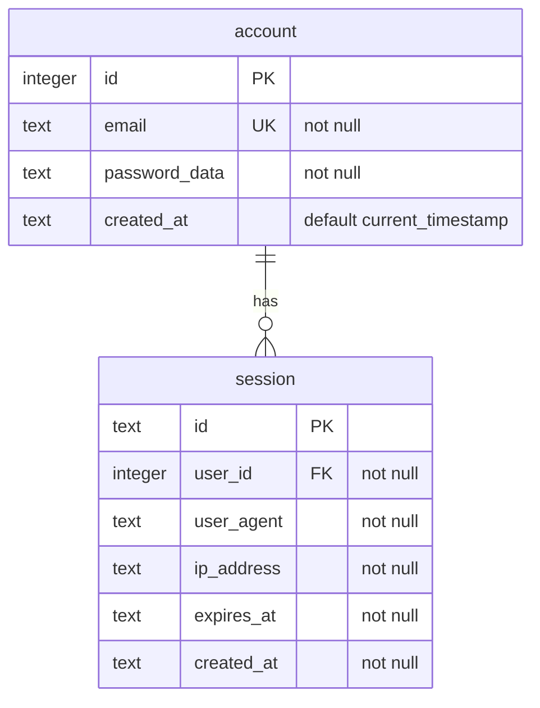

# Cloudflare Launchpad

> Launch your next Cloudflare Workers project in minutes with production-ready authentication

[](https://opensource.org/licenses/Apache-2.0)
[](https://app.fossa.com/projects/git%2Bgithub.com%2Fvhscom%2Fprivate-landing?ref=archive%2Fcloudflare-launchpad)
[](https://www.typescriptlang.org/)
[](https://workers.cloudflare.com/)

A monorepo foundation for building secure, type-safe APIs using [Cloudflare Workers](https://workers.cloudflare.com/), [Hono](https://honojs.dev/) and [Turso](https://turso.tech/).

This is the pure authentication foundation extracted from a larger audio platform project. Perfect for bootstrapping new applications that need solid auth infrastructure.

## What's Included

This foundation provides everything needed for authenticated APIs:

- **Secure Authentication** - NIST-compliant password storage, JWT-based API auth
- **Session Management** - Track devices, manage user sessions, auto-refresh tokens
- **SQLite Database** - Purpose-built schema, migrations, and management scripts
- **Edge-Ready** - Built for Cloudflare Workers with Hono and Turso
- **Developer Experience** - TypeScript, automated formatting, comprehensive docs
- **Security Features** - Rate limiting ready, following security best practices
- **Monorepo Structure** - Well-organized packages with clear boundaries

## What's NOT Included

- Audio processing capabilities (see main branch for advanced features)
- Business logic beyond authentication
- Domain-specific functionality

Perfect for:
- Building authenticated APIs at the edge
- Starting new SaaS projects quickly
- Learning modern auth implementation
- Enterprise projects needing clean Apache-2.0 foundation

## License Compliance

This foundation has been scanned and verified to contain only permissive dependencies:
- No GPL/AGPL dependencies
- No copyleft restrictions
- 100% commercial-use friendly
- Safe for enterprise adoption

Perfect for building commercial applications without license concerns.

## Repository Structure

```shell
.
├── apps/
│   └── cloudflare-workers/    # Example Cloudflare Workers implementation
├── packages/
│   ├── auth/                  # Core authentication logic
│   ├── errors/                # Shared error types and handling
│   ├── infrastructure/        # Database and middleware utilities
│   ├── schemas/               # Zod schemas for validation
│   └── types/                 # Shared TypeScript types
└── docs/
    └── adr/                   # Architecture Decision Records
```

## Package Exports

```typescript
// Core authentication functionality
import { requireAuth, securityHeaders } from "@private-landing/auth";
import { defaultSessionConfig } from "@private-landing/auth/config";

// Type-safe error handling
import { TokenError, SessionError } from "@private-landing/types/auth";

// Database utilities
import { createDbClient } from "@private-landing/infrastructure/db";
```

## Authentication System

The authentication system combines secure session management with JWT-based API access control, providing both auditability and stateless verification.

### Core Components

1. **Session Management**
   - Sessions stored in SQLite (via Turso)
   - Tracks user devices, IP addresses, and activity
   - Enforces session limits per user
   - Implements sliding expiration

2. **JWT Tokens**
   - Access token (15min expiry)
   - Refresh token (7 day expiry)
   - Tokens linked to sessions via `session_id`
   - HTTP-only secure cookies

### Authentication Flow

1. **Login Process**:
   ```
   1. Validate input against NIST-compliant schema:
      - Email format verification
      - Password normalization
      - Common password checks
   2. Validate credentials against account table
   3. Create session record with:
      - Unique session ID (nanoid)
      - User agent and IP tracking
      - Configurable expiration
   4. Generate JWT tokens:
      - Access token: {user_id, session_id, type: "access"}
      - Refresh token: {user_id, session_id, type: "refresh"}
   5. Set HTTP-only cookies:
      - access_token: Short-lived API access
      - refresh_token: Long-lived token for renewal
   ```

2. **API Request Authentication**:
   ```
   1. Check access_token cookie
   2. Validate JWT signature and expiry
   3. Verify session still exists and is valid
   4. If token expired:
      a. Check refresh token
      b. Verify refresh token validity
      c. Confirm session is still active
      d. Issue new access token
   5. Update session expiry (sliding window)
   ```

### Security Features

- Type-safe authentication flow
- Schema validation (NIST SP 800-63B compliant)
- Session tracking and limiting
- Secure cookie configuration
- CSRF protection via Same-Site
- Session-JWT linkage for revocation
- IP and user agent tracking
- Sliding session expiration
- Runtime type checking
- No unsafe type assertions

See [ADR-001: Authentication Implementation](docs/adr/001-auth-implementation.md) for detailed technical decisions and security features.

## Database Schema



## Prerequisites

1. Install [Turso CLI](https://docs.turso.tech/reference/cli)
2. Authenticate with Turso:
   ```shell
   turso auth login
   ```
3. Create database and set up access:
   ```shell
   # Create the database
   turso db create private-landing-db
   
   # Get database info and connection URL
   turso db show private-landing-db
   
   # Create auth token
   turso db tokens create private-landing-db
   ```

## Database Setup

The database can be managed using the following commands:

```shell
# First time setup: Create tables
turso db shell private-landing-db < src/db/schema/sql/schema.sql

# Development: Reset database (WARNING: destroys all data)
bun run db:reset

# Run migrations
bun run db:migrate

# Verify current tables
turso db shell private-landing-db "select name from sqlite_master where type='table'"

# Check table structure
turso db shell private-landing-db ".schema account"
```

## Password Data Format

Passwords are stored in a combined format using industry standard algorithms and NIST SP 800-132 recommendations:

```
$pbkdf2-sha384$v1$iterations$salt$hash$digest
```

Field details:
- Algorithm: PBKDF2 with SHA-384 (balance of security/performance)
- Version: Schema version for future algorithm updates
- Iterations: Key stretching count (100,000)
- Salt: 128-bit random value (NIST recommended minimum)
- Hash: PBKDF2-derived key
- Digest: Additional SHA-384 hash for verification

All binary data (salt, hash, digest) is stored as Base64. The format allows for future algorithm changes while maintaining backward compatibility.

## Environment Setup

1. Copy `.dev.vars.example` to `.dev.vars` for local development
2. For production, [set up the Turso integration](https://developers.cloudflare.com/workers/databases/native-integrations/turso/) in your Cloudflare dashboard:
   - Go to Workers & Pages → Settings → Integrations
   - Add Turso integration
   - Your `AUTH_DB_URL` and `AUTH_DB_TOKEN` will be automatically available
3. Use strong passwords for JWT access and refresh token secrets

Required environment variables:
```ini
AUTH_DB_URL="libsql://your-db.turso.io"
AUTH_DB_TOKEN="your-auth-token"
JWT_ACCESS_SECRET="your-access-secret"    # For JWT access tokens
JWT_REFRESH_SECRET="your-refresh-secret"  # For JWT refresh tokens
```

## Development

```shell
# Install dependencies
bun install

# Build packages
bun run build

# Build worker (dry-run deployment)
bun run build:workers

# Start development server
bun run dev       # Runs on port 8788

# Run tests
bun run test:workers         # Run worker tests
bun run test:workers:watch   # Run worker tests in watch mode

# Format code
bun run format              # Format all code
bun run format:packages     # Format only package code

# Type check
bun run typecheck          # Type check all packages
```

## Testing

The project uses Vitest for testing the Cloudflare Worker implementation:

- Unit tests for individual components
- Integration tests for auth flows
- End-to-end API tests
- Cloudflare Workers runtime simulation

Run tests using:

```shell
bun run test:workers        # Run all worker tests
bun run test:workers:watch  # Watch mode for development
```

## Package Management

The monorepo uses Bun workspaces for package management:

- Packages are versioned independently
- Workspace dependencies are resolved locally
- Consistent formatting with Biome
- Automated package builds

Package scripts:

```shell
bun run build             # Build all packages
bun run clean             # Clean all build artifacts
bun run typecheck         # Type check all packages
```

## Database Management

Common database tasks (run from `apps/cloudflare-workers` directory):

```shell
# Create database backup (creates timestamped .tar.gz in src/db/backups)
bun run db:backup

# Restore from backup (after extracting .tar.gz)
tar -xzf src/db/backups/backup-TIMESTAMP.tar.gz
turso db shell private-landing-db < database.sql

# Development: Reset database (WARNING: destroys all data)
bun run db:reset

# Run migrations with automatic backup
bun run db:migrate-safe   # Creates backup before migrating

# Run migrations
bun run db:migrate

# Interactive SQL shell
turso db shell private-landing-db

# Quick table data check
turso db shell private-landing-db "select email, substr(password_data, 0, 30) || '...' from account"
```

## Contributing

1. Fork the repository
2. Create a feature branch
3. Make your changes
   ```shell
   bun run typecheck
   bun run test:workers
   bun run format
   ```

The `test:workers` task contains integration tests which use the `AUTH_DB_TOKEN` and `AUTH_DB_URL` specified in `.dev.vars.test` to connect to a real database in order to validate authentication end-to-end via Turso. Generate a token for the test DB like:

```shell
cd apps/cloudflare-workers && \
    turso db tokens create private-landing-test-db 
```

A failsafe mechanism is in place requiring the word `test` within your test database name. This behavior is intended to prevent accidentally running test SQL against non-test DBs.

## Project Lineage

This foundation was extracted from a larger audio platform project:

- **This branch** (`archive/cloudflare-launchpad`): Pure Apache-2.0 auth foundation
- **Main branch**: Full platform including BSL-licensed audio fingerprinting technology
- **Canonical source**: https://codeberg.org/vhs/private-landing
- **GitHub mirror**: https://github.com/vhscom/private-landing

**Need advanced audio features?** See the main branch for cutting-edge audio fingerprinting capabilities.

## License

Apache 2.0 - Open source and commercial-friendly. Use this foundation in any project without restrictions. See [LICENSE](LICENSE) for details.