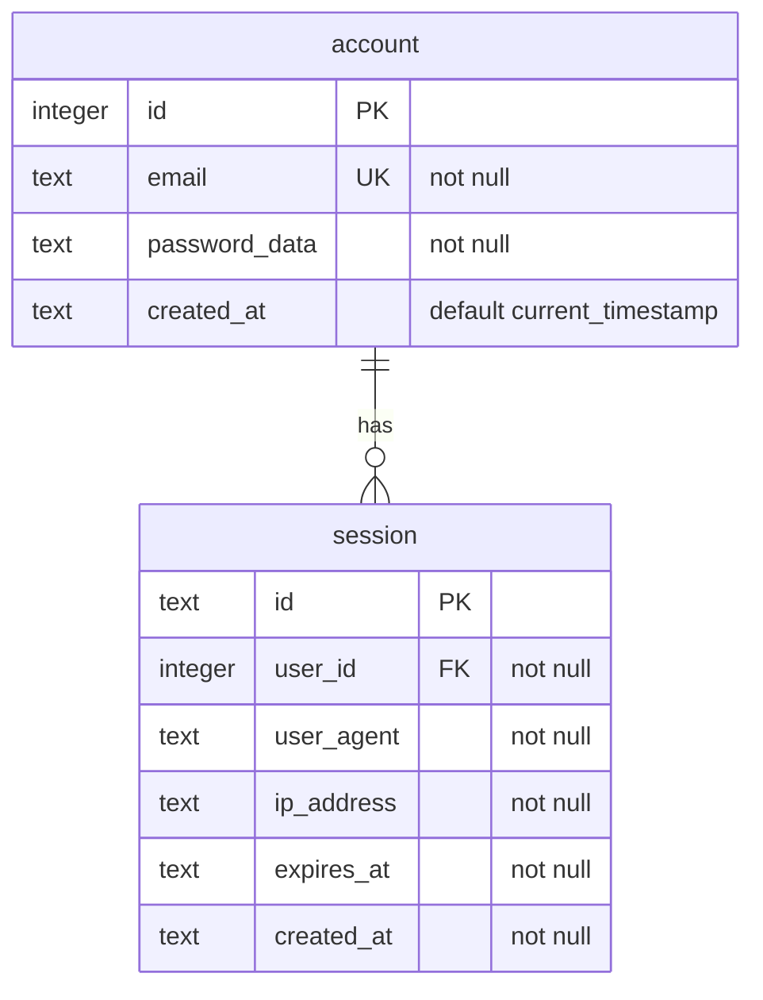

# Learn Auth

Authentication experiment using Hono + Cloudflare Workers.

## Security Features

See [ADR-001: Authentication Implementation](docs/adr/001-auth-implementation.md) for detailed technical decisions and security features.

## Database Schema



## Prerequisites

1. Install [Turso CLI](https://docs.turso.tech/reference/cli)
2. Authenticate with Turso:
```bash
turso auth login
```
3. Create database and set up access:
```bash
# Create the database
turso db create auth-db

# Get database info and connection URL
turso db show auth-db

# Create auth token
turso db tokens create auth-db
```

## Database Setup

The database can be managed using SQL scripts in the `src/db` directory:

```bash
# First time setup: Create tables
turso db shell auth-db < src/db/schema.sql

# Development: Reset database (WARNING: destroys all data)
turso db shell auth-db < src/db/reset.sql && turso db shell auth-db < src/db/schema.sql

# Run migrations (when schema changes)
turso db shell auth-db < src/db/migration.sql

# Verify current tables
turso db shell auth-db "select name from sqlite_master where type='table'"

# Check table structure
turso db shell auth-db ".schema account"
```

## Password Data Format

Passwords are stored in a combined format using industry standard algorithms and NIST SP 800-132 recommendations:

```
$pbkdf2-sha384$v1$iterations$salt$hash$digest
```

Field details:
- Algorithm: PBKDF2 with SHA-384 (balance of security/performance)
- Version: Schema version for future algorithm updates
- Iterations: Key stretching count (100,000)
- Salt: 128-bit random value (NIST recommended minimum)
- Hash: PBKDF2-derived key
- Digest: Additional SHA-384 hash for verification

All binary data (salt, hash, digest) is stored as Base64. The format allows for future algorithm changes while maintaining backward compatibility.

## Environment Setup

1. Copy `.dev.vars.example` to `.dev.vars` for local development
2. For production, [set up the Turso integration](https://developers.cloudflare.com/workers/databases/native-integrations/turso/) in your Cloudflare dashboard:
   - Go to Workers & Pages → Settings → Integrations
   - Add Turso integration
   - Your `TURSO_URL` and `TURSO_AUTH_TOKEN` will be automatically available
3. Use strong password for the `COOKIE_SIGNING` secret.

Required environment variables:
```bash
TURSO_URL="libsql://your-db.turso.io"
TURSO_AUTH_TOKEN="your-auth-token"
COOKIE_SIGNING="your-cookie-secret"    # For session management
```

## Development

```bash
# Start development server
bun run dev       # Runs on port 8788

# Run tests
bun test

# Format code
bun run format    # Biome formatter

# Check code
bun run check     # Biome linter + formatter check
```

## Database Management

Common database tasks:

```bash
# Create database backup
turso db dump auth-db > backup.sql

# Restore from backup
turso db shell auth-db < backup.sql

# Interactive SQL shell
turso db shell auth-db

# Quick table data check
turso db shell auth-db "select email, substr(password_data, 0, 30) || '...' from account"
```

## License

LGPL - Open source with required code sharing.