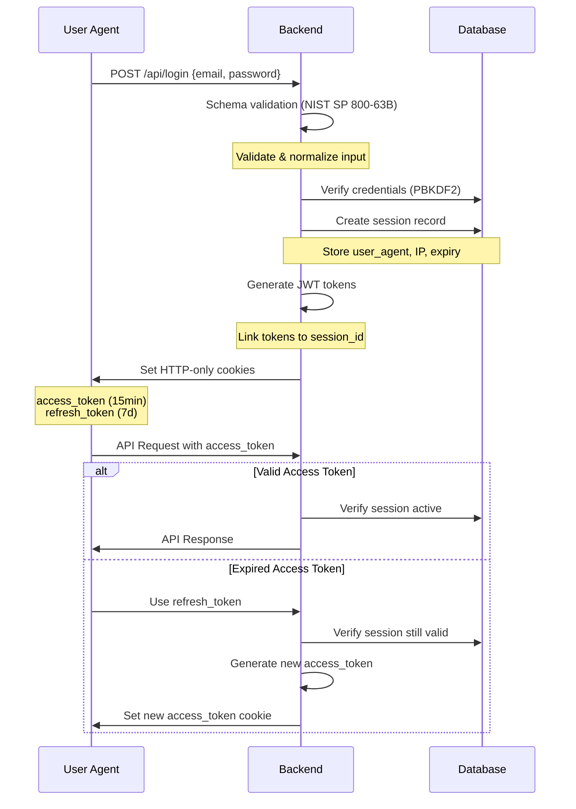
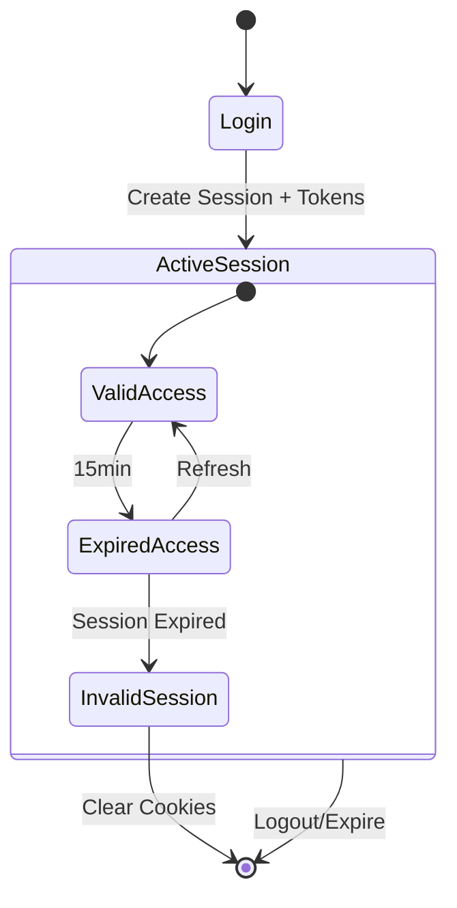

# ADR-001: Authentication Implementation

## Status

Accepted

## Context

We need to implement a secure authentication system for our web application targeting ~100 users. While we have no specific compliance requirements, the system should follow security best practices and provide a good user experience. This aligns with typical early-stage startup needs.

## Decision

Our authentication system combines secure password storage, robust session management, and JWT-based API authentication to create a comprehensive solution that provides both security and good UX.

### Password Storage

- Using PBKDF2 with SHA-384 for password hashing
- 100,000 iterations for key stretching
- 128-bit (16 byte) random salt per NIST SP 800-132
- Additional integrity digest using SHA-384
- Version tracking for future algorithm upgrades
- Storage format: `$pbkdf2-shaXXX$v1$iterations$salt$hash$digest`

### Session Management

- Session IDs generated using nanoid
  - 21 characters (vs 36 for UUID)
  - URL-safe by default
  - Better distribution for database indexes
  - ~121 bits of randomness (sufficient for session IDs)
  - Efficient cookie storage
  - Fast generation
- Server-side session storage in SQLite database
- Session limits per user (default: 3)
- IP address and user agent tracking
- Automatic cleanup of expired sessions
- Sliding expiration with 7-day default timeout

### JWT Authentication

#### Token Types and Structure

**Access Token** (15-minute lifetime):
```json
{
  "uid": 123,
  "sid": "BBH5Yw1Xzv21nKQ6UvNRt",
  "typ": "access",
  "exp": 1704724382
}
```

**Refresh Token** (7-day lifetime):
```json
{
  "uid": 123,
  "sid": "BBH5Yw1Xzv21nKQ6UvNRt",
  "typ": "refresh",
  "exp": 1705329182
}
```

#### Token Optimization
- Short claim names reduce token size
- Standard `exp` claim maintained per JWT spec
- Type-safe token validation in code
- Self-documenting type values

#### Cookie Configuration
- HTTP-only cookies
- Secure flag enabled
- Strict same-site policy
- Host-only (no Domain attribute)
- Path restricted to "/"

#### Authentication Flow



#### Token Lifecycle



### Security Features

- Constant-time comparisons for password verification
- NIST SP 800-63-3 compliant password requirements
- Protection against timing attacks
- Secure cookie attributes (httpOnly, secure, sameSite)
- Database-backed session validation
- JWT-Session linking for revocation capability
- Automatic session pruning
- Rate limiting ready

### Type Safety

Our authentication system uses TypeScript's type system to enforce security invariants:

```ts
// Discriminated union ensures userId presence when authenticated
type AuthResult = 
  | { authenticated: true; userId: number }
  | { authenticated: false; userId: null; error?: string };

// Type guard ensures type-safe auth flow
const isAuthenticated = (result: AuthResult): result is AuthenticatedState => 
  result.authenticated;
```

Key type safety features:

- Schema validation using Zod
- Discriminated unions for auth states
- Type guards for runtime safety
- NIST-compliant input validation
- No unsafe type assertions

## Consequences

### Positive

- Strong security following industry standards
- Future-proof with version tracking
- Clean separation of concerns
- Maintainable codebase
- Type-safe implementation
- Easy to upgrade security parameters
- Stateless API authentication with JWT
- Session tracking and revocation capability

### Negative

- More complex than simple password hashing
- Additional database storage requirements
- Slightly higher computational overhead
- Need to manage both sessions and JWTs
- Additional database load for session validation

## Alternatives Considered

### Password Hashing

#### Bcrypt
- Pros:
  - Well-established and battle-tested
  - Adaptive work factor
  - Built-in salt generation
  - Memory-hard function making hardware acceleration difficult
- Cons:
  - Fixed output size (60 characters)
  - Less flexible than PBKDF2
  - Limited to 72 bytes of password data
  - No version tracking built into format

#### Argon2
- Pros:
  - Winner of the Password Hashing Competition
  - Memory-hard and highly resistant to GPU attacks
  - Configurable memory, parallelism, and iterations
  - Modern algorithm with strong security properties
- Cons:
  - Relatively newer compared to PBKDF2 and Bcrypt
  - Less widespread library support
  - More complex implementation
  - Higher system requirements for memory usage

We chose PBKDF2 because:
- Widespread support across languages and platforms
- FIPS-140 compliance if needed in future
- Simpler implementation while still meeting security requirements
- Flexibility in hash function selection
- Easy to adjust iterations as computational power increases
- Built-in support in many cryptographic libraries

### Authentication Strategies

#### Pure JWT (Stateless)
- Pros:
  - Truly stateless
  - No database lookups needed
  - Simple implementation
- Cons:
  - No way to revoke tokens
  - No session tracking
  - Limited security controls

#### Pure Session-Based
- Pros:
  - Full control over sessions
  - Easy to revoke
  - Traditional and well-understood
- Cons:
  - Database lookup on every request
  - More complex scaling
  - Cookie size limitations

We chose hybrid JWT+Sessions because:
- Combines benefits of both approaches
- Provides stateless API auth while maintaining control
- Enables session tracking and management
- Allows for token revocation
- Supports device management

## Notes

- OWASP guidelines recommend 210,000 iterations
- Cloudflare limits us to 100,000 iterations
- Password format designed for upgradability
- Digest may be used to prevent tampering
- Session management considers scalability
- All security parameters are configurable
- Implementation follows NIST guidelines

## References

- [IETF RFC 2898 §5.2](https://datatracker.ietf.org/doc/html/rfc2898#section-5.2)
- [IETF RFC 7519 - JSON Web Token (JWT)](https://tools.ietf.org/html/rfc7519)
- [IETF RFC 9106](https://datatracker.ietf.org/doc/rfc9106/) (informational)
- [NIST SP 800-132](https://nvlpubs.nist.gov/nistpubs/Legacy/SP/nistspecialpublication800-132.pdf)
- [NIST SP 800-63-3](https://pages.nist.gov/800-63-3/)
- [OWASP Password Storage Cheat Sheet](https://cheatsheetseries.owasp.org/cheatsheets/Password_Storage_Cheat_Sheet.html)
- [OWASP Session Management Cheat Sheet](https://cheatsheetseries.owasp.org/cheatsheets/Session_Management_Cheat_Sheet.html)
- [Cookie Security: SameSite FAQ](https://web.dev/samesite-cookies-explained/)