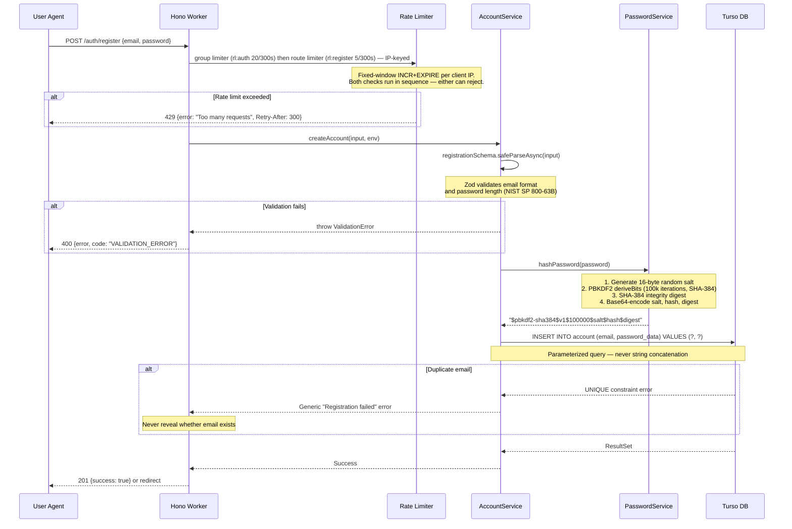
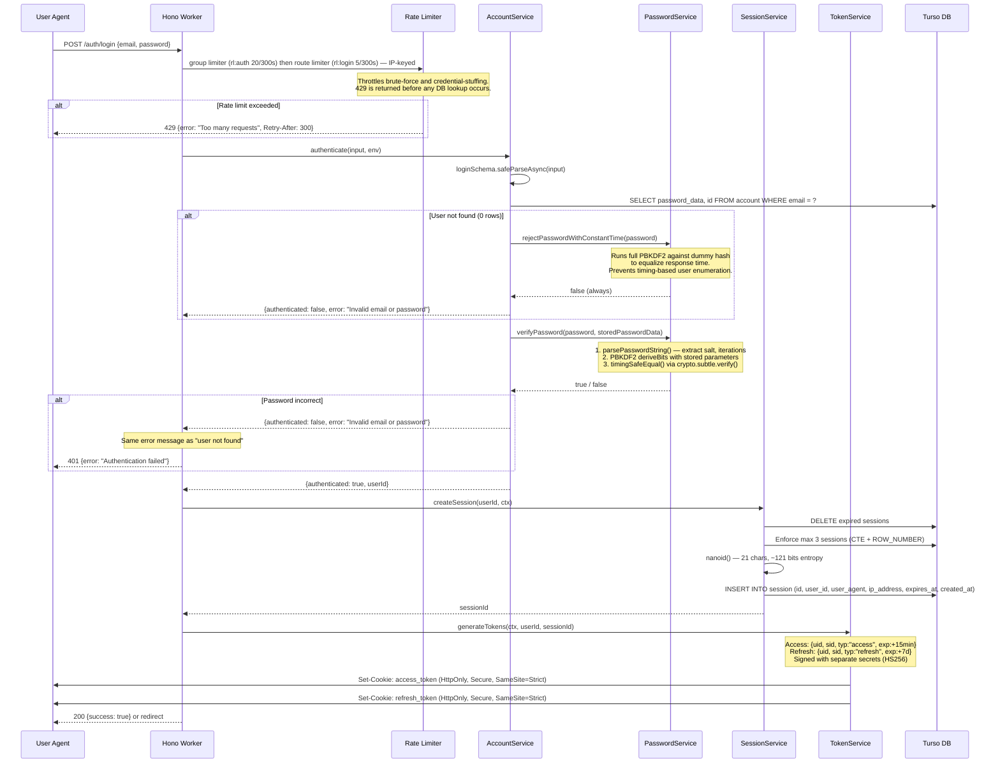
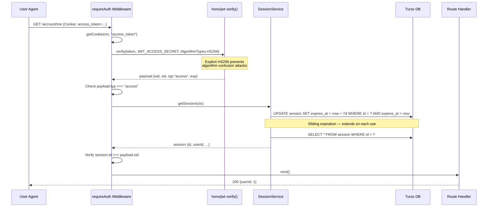
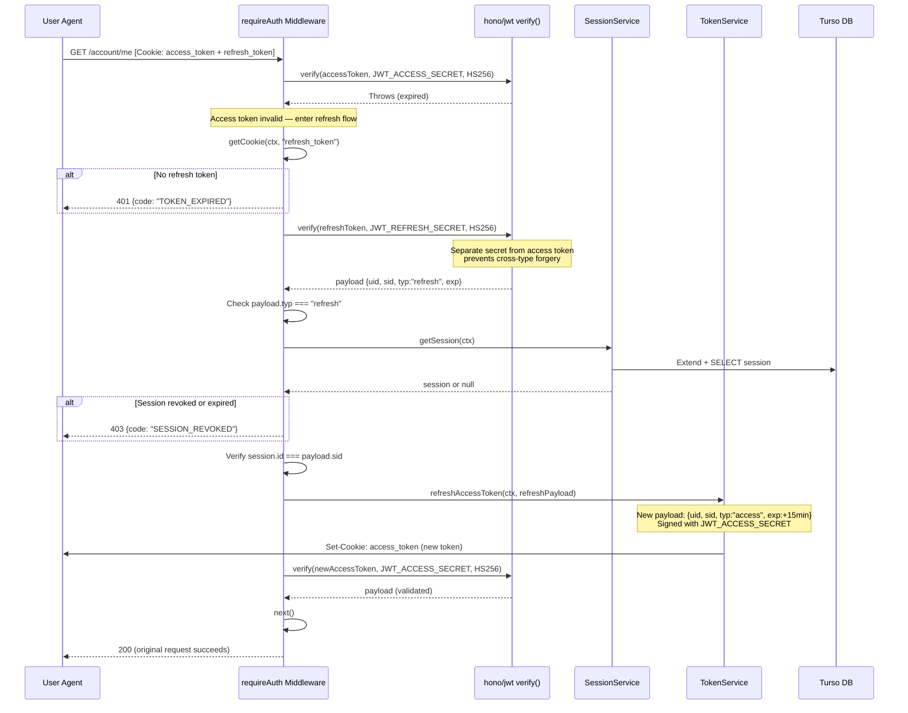
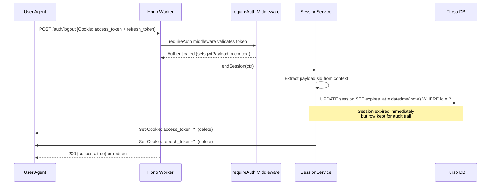
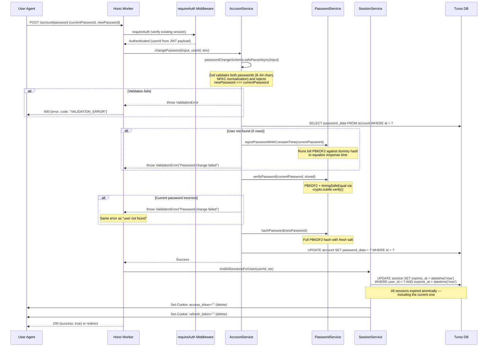

# Authentication Flow Diagrams

Sequence diagrams for every authentication flow in Private Landing. Each diagram maps directly to source code in `packages/core/`.

> **Note:** The diagrams below show the default SQL-backed session path. Sessions can optionally be stored in Valkey/Redis cache instead, replacing SQL round-trips with cache GET/SET operations. See [ADR-003](adr/003-cache-layer-valkey.md) for details.

> **Rate limiting:** Fixed-window middleware gates public auth routes before any business logic runs. Requests exceeding the threshold receive `429 Too Many Requests` with a `Retry-After` header. When no cache is configured the rate limiter degrades to a no-op pass-through. See [ADR-006](adr/006-rate-limiting.md).

> **Rendering:** GitHub renders Mermaid natively. For local preview, use the [Mermaid Live Editor](https://mermaid.live) or a VS Code extension.

---

## 1. Registration

User creates a new account. The password is hashed with PBKDF2-SHA384 before storage.

**Source:** [`account-service.ts:125-147`](../packages/core/src/auth/services/account-service.ts) | [`password-service.ts:203-249`](../packages/core/src/auth/services/password-service.ts)

---

## 2. Login

Full authentication flow from credential verification through token issuance.

**Source:** [`account-service.ts:149-213`](../packages/core/src/auth/services/account-service.ts) | [`session-service.ts:221-268`](../packages/core/src/auth/services/session-service.ts) | [`token-service.ts:67-114`](../packages/core/src/auth/services/token-service.ts) | [`app.ts:185-236`](../apps/cloudflare-workers/src/app.ts)

---

## 3. Normal API Request

Accessing a protected endpoint with a valid access token.

**Source:** [`require-auth.ts:67-124`](../packages/core/src/auth/middleware/require-auth.ts) | [`require-auth.ts:163-191`](../packages/core/src/auth/middleware/require-auth.ts) (verifyToken) | [`session-service.ts:270-296`](../packages/core/src/auth/services/session-service.ts)

---

## 4. Token Refresh

When the access token expires, the middleware transparently refreshes it using the refresh token.

**Source:** [`require-auth.ts:85-103`](../packages/core/src/auth/middleware/require-auth.ts) | [`token-service.ts:116-143`](../packages/core/src/auth/services/token-service.ts)

---

## 5. Logout

Ends the server-side session and clears both auth cookies.

**Source:** [`session-service.ts:298-314`](../packages/core/src/auth/services/session-service.ts) | [`app.ts:129-153`](../apps/cloudflare-workers/src/app.ts)

---

## 6. Password Change

User changes their password. Requires re-verification of the current password even though the user is authenticated. All sessions are revoked afterward, forcing re-authentication on every device.

**Source:** [`account-service.ts:215-268`](../packages/core/src/auth/services/account-service.ts) | [`session-service.ts:316-331`](../packages/core/src/auth/services/session-service.ts) | [`app.ts:239-280`](../apps/cloudflare-workers/src/app.ts) | [ADR-004](adr/004-password-change-endpoint.md)
