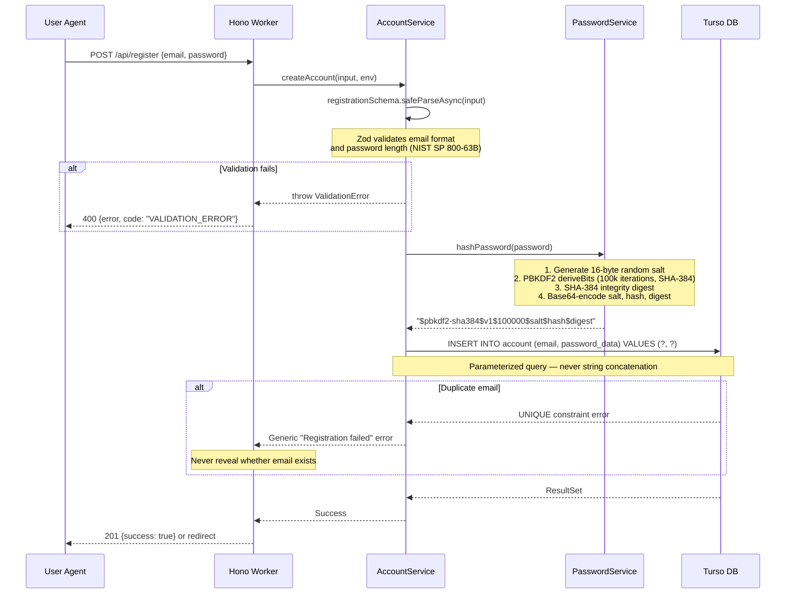
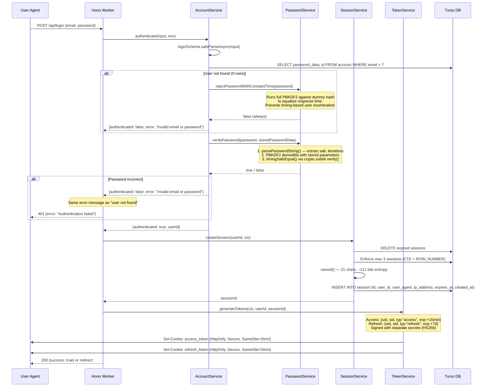
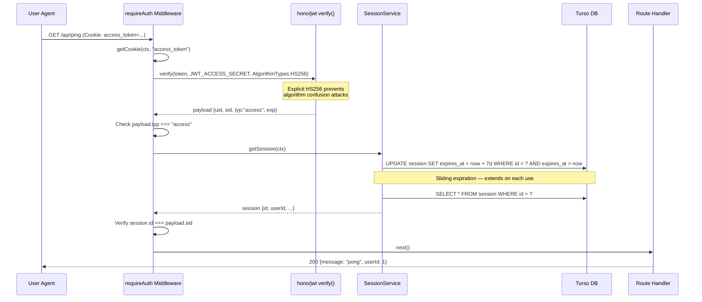
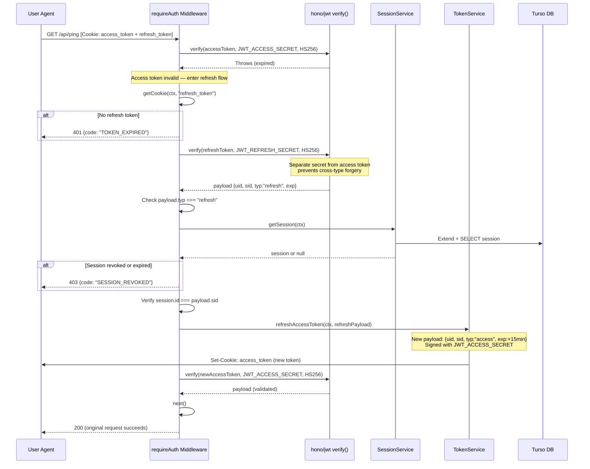
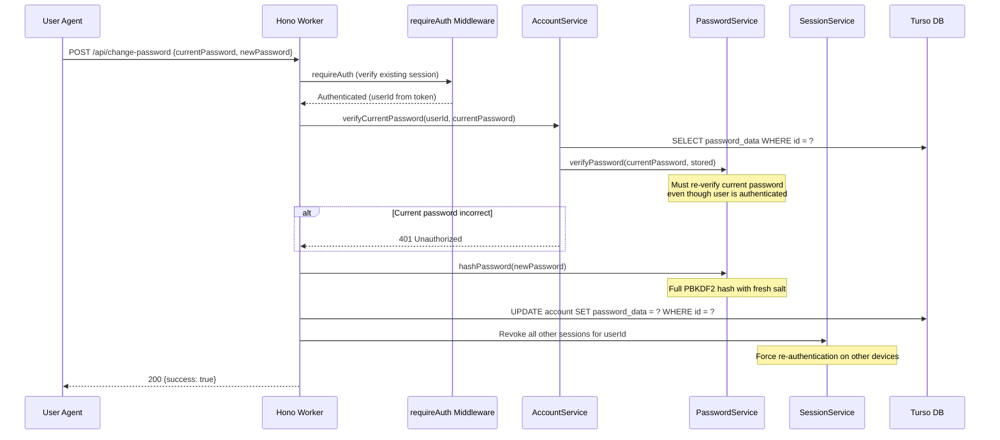

# Authentication Flow Diagrams

Sequence diagrams for every authentication flow in Private Landing. Each diagram maps directly to source code in `packages/core/`.

> **Rendering:** GitHub renders Mermaid natively. For local preview, use the [Mermaid Live Editor](https://mermaid.live) or a VS Code extension.

---

## 1. Registration

User creates a new account. The password is hashed with PBKDF2-SHA384 before storage.

**Source:** [`account-service.ts:108-130`](../packages/core/src/auth/services/account-service.ts) | [`password-service.ts:203-249`](../packages/core/src/auth/services/password-service.ts)

---

## 2. Login

Full authentication flow from credential verification through token issuance.

**Source:** [`account-service.ts:132-196`](../packages/core/src/auth/services/account-service.ts) | [`session-service.ts:204-248`](../packages/core/src/auth/services/session-service.ts) | [`token-service.ts:67-114`](../packages/core/src/auth/services/token-service.ts) | [`app.ts:67-105`](../apps/cloudflare-workers/src/app.ts)

---

## 3. Normal API Request

Accessing a protected endpoint with a valid access token.

**Source:** [`require-auth.ts:67-124`](../packages/core/src/auth/middleware/require-auth.ts) | [`require-auth.ts:163-191`](../packages/core/src/auth/middleware/require-auth.ts) (verifyToken) | [`session-service.ts:250-276`](../packages/core/src/auth/services/session-service.ts)

---

## 4. Token Refresh

When the access token expires, the middleware transparently refreshes it using the refresh token.

**Source:** [`require-auth.ts:85-103`](../packages/core/src/auth/middleware/require-auth.ts) | [`token-service.ts:116-143`](../packages/core/src/auth/services/token-service.ts)

---

## 5. Logout

Ends the server-side session and clears both auth cookies.

**Source:** [`session-service.ts:278-294`](../packages/core/src/auth/services/session-service.ts) | [`app.ts:107-124`](../apps/cloudflare-workers/src/app.ts)

---

## 6. Password Change (Not Yet Implemented)

> **Gap:** Password change is not yet implemented. See [ADR-002](adr/002-future-enhancements.md) for planned work and the [threat model](threat-model.md) for security implications.

The expected flow when implemented:

