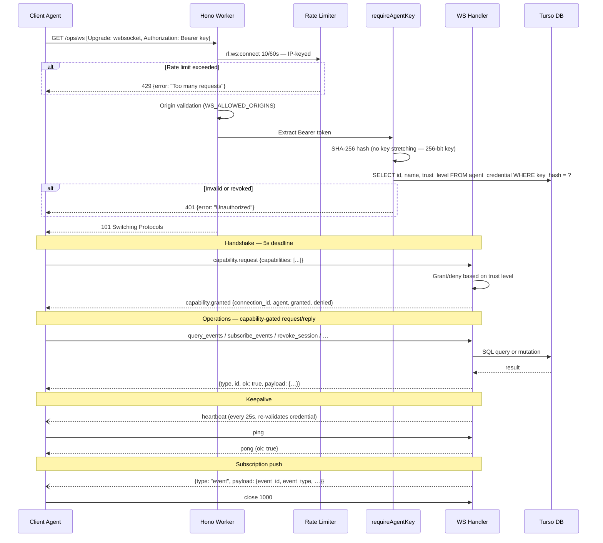

# Ops WebSocket Protocol

WebSocket gateway for real-time security event streaming and session management.

**Endpoint:** `/ops/ws`  
**Protocol:** `wss` (production), `ws` (development)  
**Auth:** `Authorization: Bearer <agent-api-key>` on upgrade  
**Spec:** [ADR-009](adr/009-ops-websocket-gateway.md)

---

## Naming conventions

Message types follow two conventions based on their role:

- **Dot notation** (`resource.action`) — namespaced domain messages that map to `security_event` rows or form request/response pairs within a namespace. Examples: `capability.request`, `capability.granted`, `credential.revoked`, `subscription.backpressure`.
- **Snake case** — protocol primitives and capability-gated operations. Examples: `ping`, `pong`, `heartbeat`, `query_events`, `subscribe_events`.

---

## Connection lifecycle



---

## Handshake

### `capability.request` (client → server)

```json
{
  "type": "capability.request",
  "capabilities": ["subscribe_events", "query_events"]
}
```

The capabilities array accepts arbitrary strings. Unknown capabilities are denied gracefully with reason `"unknown capability"` rather than failing the parse.

### `capability.granted` (server → client)

```json
{
  "type": "capability.granted",
  "connection_id": "g2Vd4RfhWvNd0KiNTEyTv",
  "agent": "midnight-falcon",
  "granted": ["subscribe_events", "query_events"],
  "denied": []
}
```

Denied entries include `{ "capability": "...", "reason": "..." }`.

**Deadline:** 5 s from upgrade. Close `4001` on timeout.

**Re-negotiation:** Sending a second `capability.request` after negotiation returns an error with `ALREADY_NEGOTIATED` and echoes the `connection_id` so the client can recover it without reconnecting:

```json
{
  "type": "capability.request",
  "connection_id": "g2Vd4RfhWvNd0KiNTEyTv",
  "ok": false,
  "error": { "code": "ALREADY_NEGOTIATED", "message": "Already negotiated" }
}
```

---

## Keepalive

| Message | Direction | Purpose |
|---|---|---|
| `heartbeat` | server → client | Sent every 25 s after credential re-validation. Contains `ts`, `next_check_ms`, `ping_timeout_ms`, and `capabilities`. |
| `ping` | client → server | Resets the 90 s ping timeout. `id` field is optional. |
| `pong` | server → client | Reply to `ping`. Echoes `id` when present, omits it when absent. Includes `ok: true`. |

Only application-level messages reset the ping timeout timer — WebSocket protocol pings do not.

### `heartbeat` (server → client)

```json
{
  "type": "heartbeat",
  "ts": 1709510400000,
  "next_check_ms": 25000,
  "ping_timeout_ms": 90000,
  "capabilities": ["query_events", "subscribe_events"]
}
```

### `ping` / `pong`

```json
{ "type": "ping", "id": "k1" }
{ "type": "pong", "id": "k1", "ok": true }
```

```json
{ "type": "ping" }
{ "type": "pong", "ok": true }
```

### `credential.revoked` (server → client)

Sent before close `4010` when the agent credential is found revoked or unreachable during a heartbeat check. After 3 consecutive check failures the server closes the connection rather than failing open indefinitely.

```json
{
  "type": "credential.revoked",
  "reason": "key_revoked",
  "guidance": "Re-authenticate with a new agent key"
}
```

`reason`: `"key_revoked"`, `"credential_not_found"`, or `"credential_check_unavailable"`.

### `subscription.backpressure` (server → client)

Sent after a subscription poll when the result set hits the per-poll limit. Signals that the client is falling behind — events are not lost but may be delayed.

```json
{
  "type": "subscription.backpressure",
  "count": 100,
  "limit": 100
}
```

---

## Operations

All operations require a granted capability and use request/reply over the same connection. Requests include `type`, `id` (1–64 chars, for correlation), and `payload` (defaults to `{}` when omitted). Replies echo `type` and `id` with `ok: true` or `ok: false` + `error`.

### Capabilities

| Capability | Trust | Description |
|---|---|---|
| `query_events` | read | One-shot event query (pass `aggregate: true` for counts by type) |
| `query_sessions` | read | One-shot session list |
| `subscribe_events` | read | Live event stream (also gates `unsubscribe_events`) |
| `revoke_session` | write | Revoke by scope: `user`, `session`, or `all` |

### `query_events`

```json
{
  "type": "query_events",
  "id": "q1",
  "payload": {
    "since": "2026-03-04T00:00:00Z",
    "event_type": "login.failure",
    "user_id": 42,
    "ip": "203.0.113.1",
    "actor_id": "app:private-landing",
    "limit": 50,
    "offset": 0
  }
}
```

All payload fields optional. Defaults: `since` = 24 h ago, `limit` = 50. `actor_id` filters by the actor that produced the event.

```json
{
  "type": "query_events",
  "id": "q1",
  "ok": true,
  "payload": { "events": [...], "count": 3 }
}
```

Pass `aggregate: true` to get counts by event type instead of rows:

```json
{
  "type": "query_events",
  "id": "q2",
  "payload": { "aggregate": true, "since": "2026-03-04T00:00:00Z" }
}
```

```json
{
  "type": "query_events",
  "id": "q2",
  "ok": true,
  "payload": { "since": "2026-03-04T00:00:00Z", "stats": { "login.success": 12, "login.failure": 3 } }
}
```

### `query_sessions`

```json
{
  "type": "query_sessions",
  "id": "s1",
  "payload": { "user_id": 42, "active": true, "limit": 50, "offset": 0 }
}
```

```json
{
  "type": "query_sessions",
  "id": "s1",
  "ok": true,
  "payload": { "sessions": [...], "count": 5 }
}
```

### `subscribe_events`

```json
{
  "type": "subscribe_events",
  "id": "sub1",
  "payload": { "types": ["login.*", "session.revoke"] }
}
```

`types` is optional — omit for all events. Patterns: exact (`login.success`) or wildcard (`login.*`).

One subscription per connection. Send `unsubscribe_events` before starting a new one.

```json
{
  "type": "subscribe_events",
  "id": "sub1",
  "ok": true,
  "payload": { "interval_ms": 5000 }
}
```

#### Event push

Events are pushed in a normalized envelope during an active subscription (polled every 5 s). The DB row's `id` and `type` columns are renamed to `event_id` and `event_type` to avoid collision with the protocol's `type` discriminator and correlation `id`. The `detail` column is parsed from its stored JSON string into an object:

```json
{
  "type": "event",
  "payload": {
    "event_id": 1234,
    "event_type": "login.failure",
    "ip_address": "203.0.113.1",
    "user_id": null,
    "detail": { "email": "*@example.com" },
    "created_at": "2026-03-04T12:00:00.000Z",
    "actor_id": "app:private-landing"
  }
}
```

### `unsubscribe_events`

```json
{ "type": "unsubscribe_events", "id": "unsub1" }
```

```json
{ "type": "unsubscribe_events", "id": "unsub1", "ok": true }
```

### `revoke_session`

```json
{
  "type": "revoke_session",
  "id": "r1",
  "payload": { "scope": "user", "target_id": 42 }
}
```

`scope`: `"user"` (all sessions for user), `"session"` (single session by ID), or `"all"` (every active session). `target_id` is required for `user` and `session` scopes.

```json
{
  "type": "revoke_session",
  "id": "r1",
  "ok": true,
  "payload": { "revoked": 3 }
}
```

Revoke all sessions:

```json
{ "type": "revoke_session", "id": "r2", "payload": { "scope": "all" } }
```

```json
{ "type": "revoke_session", "id": "r2", "ok": true, "payload": { "revoked": 12 } }
```

---

## Error responses

```json
{
  "type": "query_events",
  "id": "q1",
  "ok": false,
  "error": {
    "code": "CAPABILITY_NOT_GRANTED",
    "message": "Requires capability: query_events"
  }
}
```

Error codes: `CAPABILITY_NOT_GRANTED`, `INVALID_PAYLOAD`, `INTERNAL_ERROR`, `SUBSCRIPTION_ACTIVE`, `SUBSCRIPTION_LIMIT`, `ALREADY_NEGOTIATED`.

---

## Close codes

| Code | Name | Meaning |
|---|---|---|
| `1000` | NORMAL | Clean shutdown |
| `4001` | HANDSHAKE_TIMEOUT | `capability.request` not received within 5 s |
| `4002` | PROTOCOL_ERROR | Malformed JSON or unknown message type |
| `4008` | RATE_LIMITED | Exceeded 60 messages per 60 s window |
| `4009` | SERVER_SHUTDOWN | Worker eviction or restart |
| `4010` | CREDENTIAL_REVOKED | Agent key revoked, deleted, or unreachable (3 consecutive failures) |
| `4011` | PING_TIMEOUT | No client messages for 90 s |

---

## Limits

| Parameter | Value |
|---|---|
| Handshake deadline | 5 s |
| Message rate | 60 / 60 s per connection |
| Ping timeout | 90 s |
| Heartbeat interval | 25 s |
| Subscription poll interval | 5 s |
| Subscription poll batch | 100 events |
| Max concurrent subscriptions (per isolate) | 50 |
| Default query limit | 50 |
| Max query limit | 200 |
| Message ID length | 1–64 chars |

---

## Event types

```
login.success        login.failure           password.change
session.revoke       session.revoke_all      session.ops_revoke
agent.auth_failure   agent.provisioned       agent.revoked
capability.granted   capability.denied       challenge.issued
challenge.failed     registration.failure    rate_limit.reject
ws.connect           ws.connect_failure      ws.disconnect
ws.unauthorized      ws.credential_revoked
```

Filter patterns for `subscribe_events`: exact match (`login.success`) or group wildcard (`login.*`).
